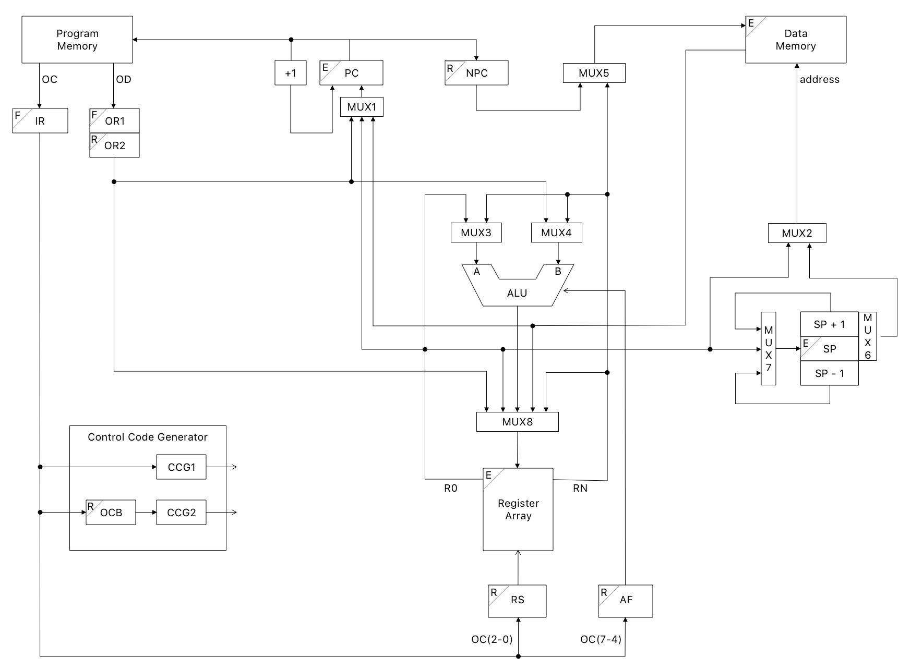

# RNBIP_Pipelined-Microprocessor

Basic 8-bit microprocessor.

3-stage Pipeline:
1. Fetch
2. Read
3. Execute

## Architecture Diagram

The letter on the top left corner in each register denotes the cycle in which it is updated.
- F: Fetch
- R: Read
- E: Execute

 

**Fetch**: In the fetch stage, the opcode and operand are read from the program memory, addressed by the program counter. The opcode is stored in the Instruction Register (IR) and operand is stored in the Operand Register 1 (OR1).

**Read**: The operand is buffered and copied into OR2 from OR1. Simultaneously, OR1 gets loaded with a new value of the operand, coming from the next fetch cycle.

**Execute**: The register values are read, ALU/data memory operations take place and any the registers are updated if needed. In case of a branch the program counter and stack pointer are updated as necessary.

 

Registers updated in each stage:

_Fetch stage_
- Instruction Register (IR)
- Operand Register 1 (OR1)

_Read stage_
- Operand Register 2 (OR2)
- Opcode Buffer (OCB)
- Next Program Counter (NPC)
- Register Select (RS)
- ALU Flags (AF)

_Execute stage_
- Register Array
- Program Counter (PC)
- Stack Pointer (SP)
- Data Memory (DM)

 

## Instruction Flow

**Stepwise Explanation**

_Cycle 1_: In the first clock cycle, the opcode and operand of the first instruction, `I1`, are fetched. The value of the program counter is also incremented. Both of them occur simultaneously.

_Cycle 2_: In the second clock cycle, the fetch stage for the next instruction, `I2`, takes place. Concurrently, the read stage of `I1` takes place in which the operand is now buffered in `OR2` and the program counter value of `I2` (which is the incremented value of `[PC]`1) is buffered in `NPC`.

_Cycle 3_: In the third clock cycle, the fetch stage of the third instruction `I3`, the read stage of `I2` and the execute stage of `I1` occur simultaneously. In the execute stage, the address(`addr`) for the data memory is decided from the two possibilities. It can either be supplied from `R0` or `SP`. The multiple possible operations that can take place are as follows.
- ALU: The ALU operation might either occur between `[R0]` and `[RN]`, or between `[RN]` and the operand (stored in `[OR2]`). The result of this operation is stored in a register.
- Write Memory: `[RN]` might be stored at the address (`addr`) specified by `[R0]`. In case of a branch statement, `[NPC]` might be stored at the address given by the stack pointer; this value is later read and loaded into the PC using a return instruction.
- Read Memory: `[[R0]]` (i.e. the data in data memory at address given by the value in R0) might be read into `[RN]`. In case of a return instruction (i.e. return from a branch), the value read from the address given by the stack pointer might be loaded into the `PC`.
- Register Data Transfer: The operand might be stored in any register of the register array: `[R0]←[RN]`. Data transfer between registers. `[R0]←[RN]` or `[RN]←[R0]`. (Note that RN cannot be used to refer to R0 in this case.)

 

